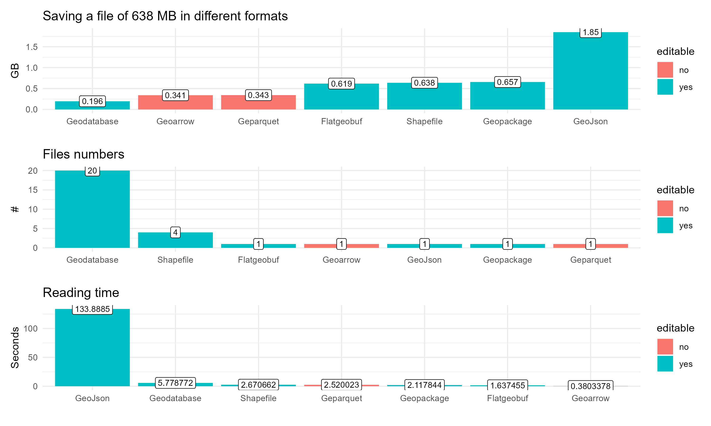

# **A simple analysis of vector formats of the Geographical Information Systems**

📁 In this repository, you can find the results of analysis of various vector file formats. 📊
🔍 All analyses were conducted using QGIS and R software. 💻
📈 The results were obtained after the mean of 10 repetitions. 🔢

## 🟢 References 
- *https://pro.arcgis.com/en/pro-app/latest/help/data/geodatabases/manage-file-gdb/file-geodatabase-size-and-name-limits.htm*
- *https://www.geopackage.org/spec120/#:~:text=The%20maximum%20size%20of%20a,maximum%20size%20limit%20of%204GB*
- *https://desktop.arcgis.com/en/arcmap/latest/manage-data/shapefiles/geoprocessing-considerations-for-shapefile-output.htm#:~:text=There%20is%20a%202%20GB,%20equivalent%20to%20a%20point*
- *https://doc.arcgis.com/en/iot/ingest/geojson.htm#:~:text=GeoJSON%20file%20size,than%20100%20MB%20per%20file*
- *https://geoarrow.org/*
- *https://flatgeobuf.org/*
